<a name="top"></a>
[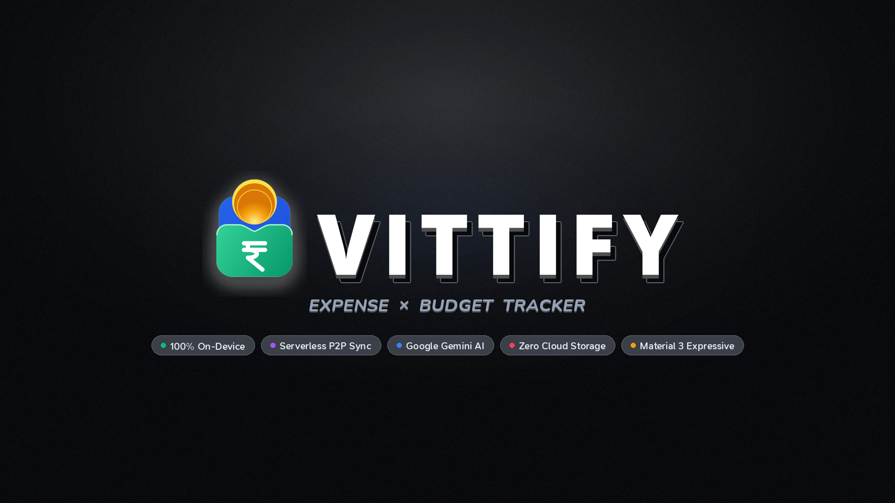]()

<p align="center">
  <a href="LICENSE"></a>
  <a href="https://developer.android.com/about/versions/oreo"></a>
  <a href="https://kotlinlang.org/"></a>
  <a href="https://developer.android.com/jetpack/compose"></a>
  <a href="https://m3.material.io/"></a>
  <a href="#privacy--offline-sovereignty"></a>
</p>

---

## Vittify — Clean, 100% Private & Effortless Expense Tracker

> **"A tiny, smart financial companion that makes tracking money surprisingly delightful."**

**Vittify** is a modern, open-source, offline-first personal finance companion built from the ground up for Android. It turns cryptic bank SMS notifications and digital UPI PDF statements into a clean, scannable, and actionable financial timeline—without sacrificing your privacy.

Unlike traditional personal finance trackers that harvest personal banking data on remote servers, Vittify operates with **zero server dependencies**:
- **100% On-Device Processing**: SMS reading, PDF statement parsing, pattern categorization, and analytics never leave your device.
- **Serverless Partner / Couple Sync**: Securely synchronize spending with a partner using peer-to-peer encrypted local mesh networks (Nearby & WebRTC)—no accounts, no cloud databases, and zero intermediary servers.
- **Frictionless Expense Logging**: Auto-parse SMS alerts, pin the Home Screen Quick Add widget, or log cash in seconds.
- **Material 3 Expressive UI**: Crafted with generous 28dp squircle platters, spring physics, rolling numbers, tactile haptics, and tonal surface hierarchies.

---

## ⚡ Built for Speed — Add Transactions Without Friction

Tracking money should take seconds, not feel like a daily chore. Vittify gives you multiple effortless ways to log spending:

- **Automatic SMS Parsing**: Spend as usual. Vittify reads incoming bank alerts on-device and auto-categorizes them in real time—no manual entry needed.
- **Home Screen Quick Add Widget**: Log cash spending, street food, or transit fares directly from your launcher in two taps without opening the app.
- **Streamlined Add Flow**: A distraction-free, tactile add screen with rolling numbers, quick account pickers, and smart category suggestions.
- **Instant Statement Import**: Drop in monthly UPI statements (Google Pay, PhonePe, Paytm) or bank PDFs to ingest whole ledgers at once.
- **Plain-English Quick Add (Beta)**: Type or paste natural phrases like *"₹450 groceries at Blinkit via HDFC"* to auto-fill transactions.

---

## 📸 Screenshots Showcase

Captured directly from **Google Pixel 7 Pro** running the latest Vittify Beta build:

### 1. Timeline, Receipts & Global Search

<table>
  <tr>
    <td align="center" width="25%">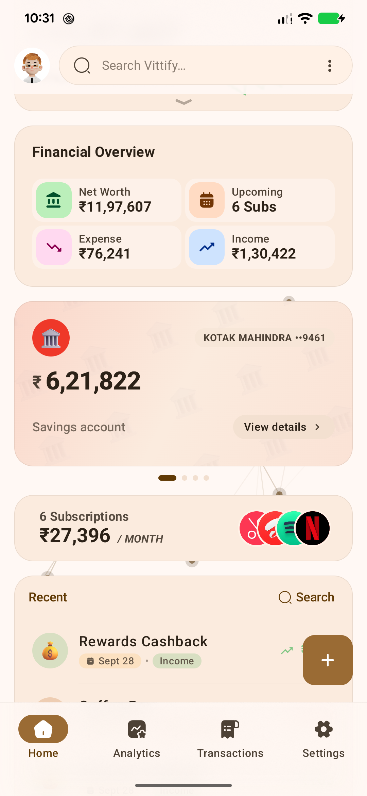<br /><b>Home Platter Canvas</b><br /><sub>Financial overview, bank balances, recent spend</sub></td>
    <td align="center" width="25%">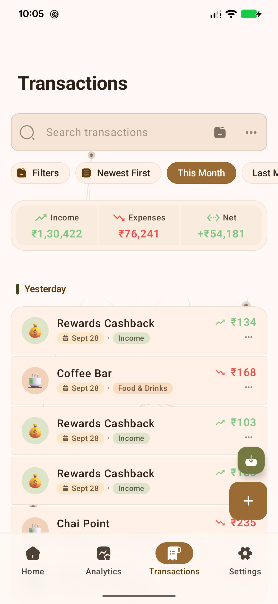<br /><b>Transactions Timeline</b><br /><sub>Date-grouped records with live net totals & quick filters</sub></td>
    <td align="center" width="25%">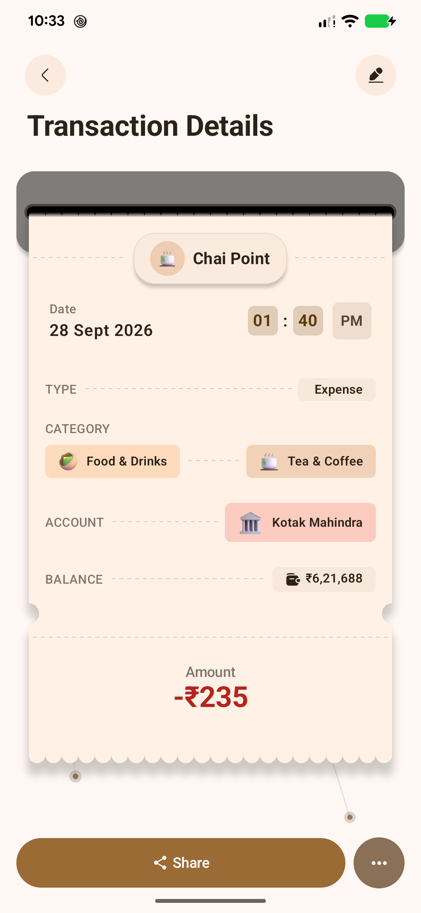<br /><b>Physical Receipt Slip</b><br /><sub>Tactile receipt design with account & tag metadata</sub></td>
    <td align="center" width="25%">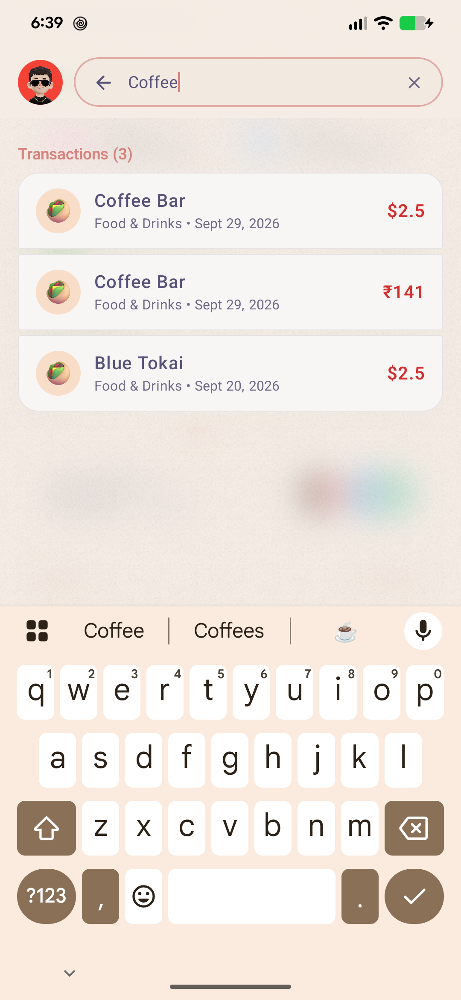<br /><b>Global Search</b><br /><sub>Instant multi-currency queries with live conversions</sub></td>
  </tr>
</table>

### 2. Financial Intelligence, Subscriptions & Budgets

<table>
  <tr>
    <td align="center" width="25%">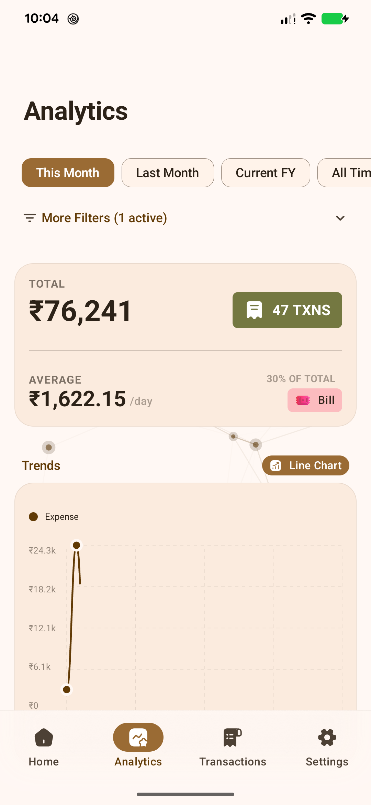<br /><b>Analytics Overview</b><br /><sub>Interactive trend curves, savings rate & period toggles</sub></td>
    <td align="center" width="25%">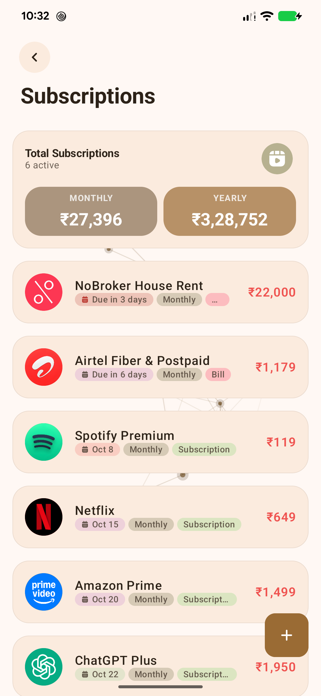<br /><b>Subscriptions Platter</b><br /><sub>Monthly/yearly projections & service commitments</sub></td>
    <td align="center" width="25%">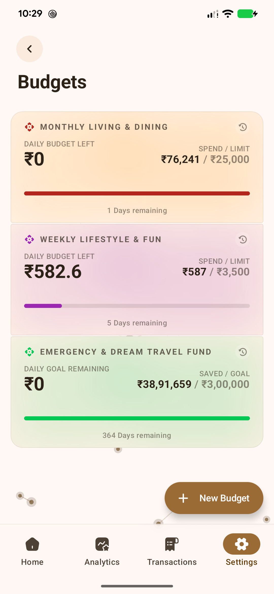<br /><b>Monthly Budgets</b><br /><sub>Visual progress bars, daily allowances & days left</sub></td>
    <td align="center" width="25%">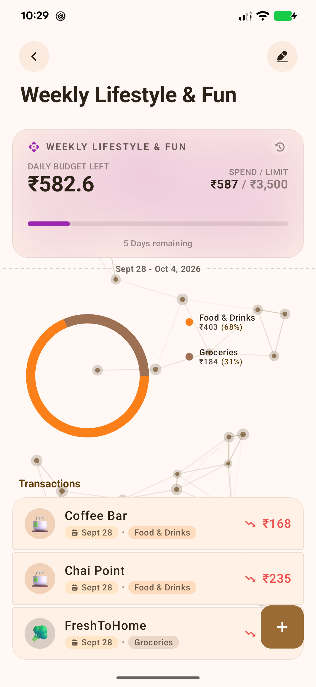<br /><b>Budget Category Donut</b><br /><sub>Granular category breakdown & linked transactions</sub></td>
  </tr>
</table>

### 3. Couple / Partner P2P Sync & Categories

<table>
  <tr>
    <td align="center" width="25%"><br /><b>Couple / Partner Sync</b><br /><sub>Serverless encrypted P2P pairing via Nearby & WebRTC</sub></td>
    <td align="center" width="25%">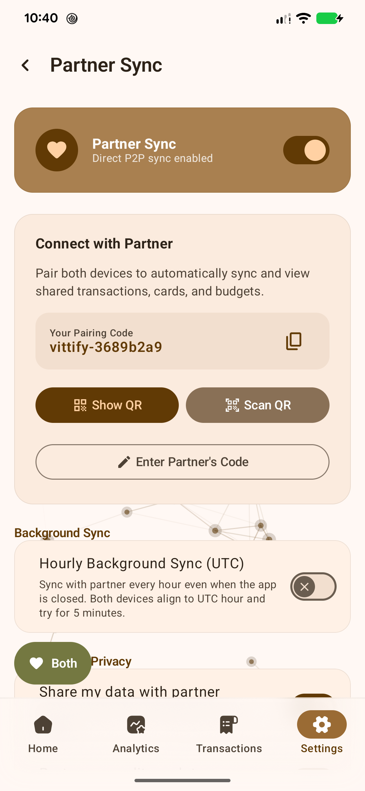<br /><b>Instant QR Pairing</b><br /><sub>Zero-setup device-to-device local key handshake</sub></td>
    <td align="center" width="25%">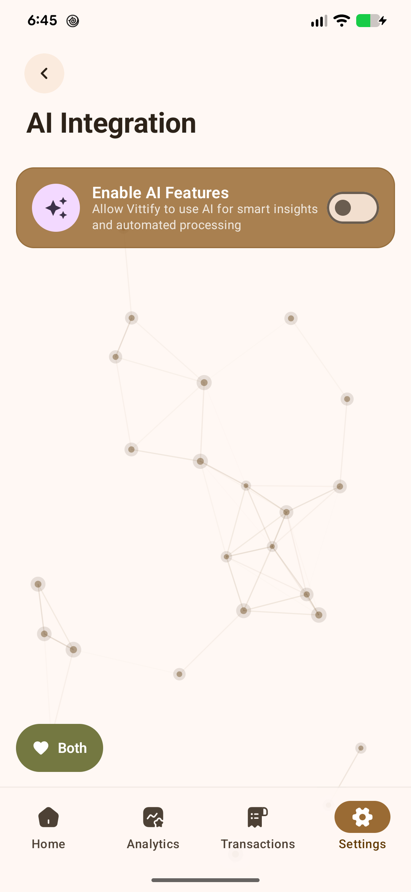<br /><b>Gemini Quick Add (Beta)</b><br /><sub>Optional BYOK key with offline token tracking</sub></td>
    <td align="center" width="25%">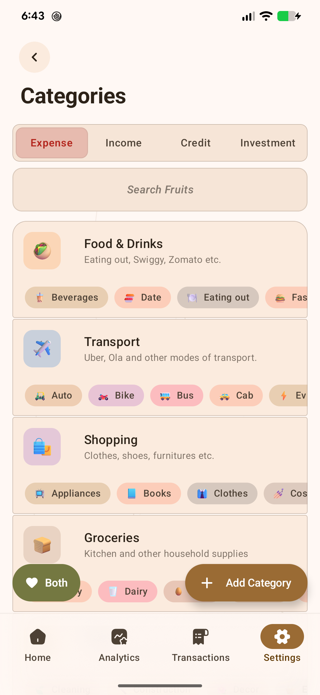<br /><b>Categories Hub</b><br /><sub>Tabs for Expense, Income, Credit & Investment</sub></td>
  </tr>
</table>

### 4. Personalization, Accounts & Quick Actions

<table>
  <tr>
    <td align="center" width="25%">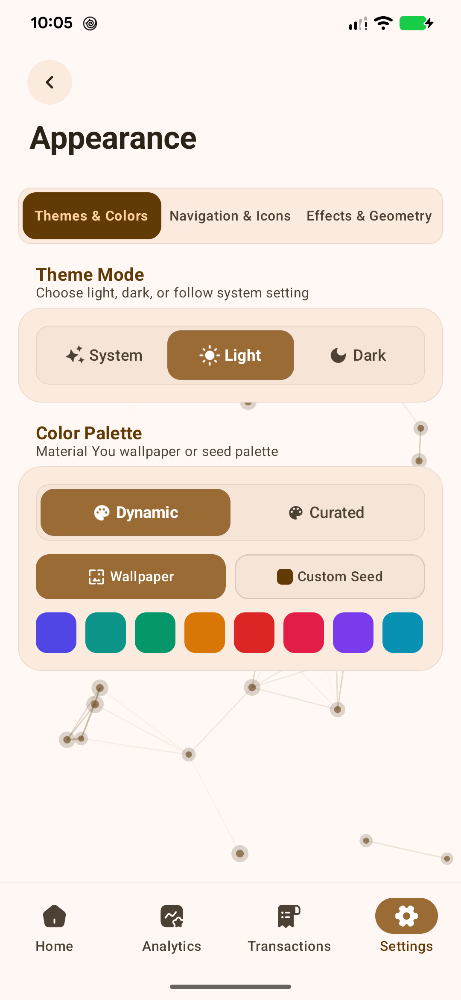<br /><b>Themes & Monet</b><br /><sub>Dynamic palette seeds, curated palettes & typography</sub></td>
    <td align="center" width="25%">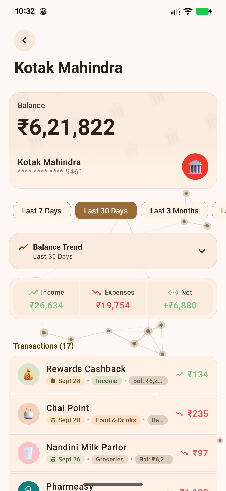<br /><b>Account Balances</b><br /><sub>Running balance ledger & balance trend graphs</sub></td>
    <td align="center" width="25%">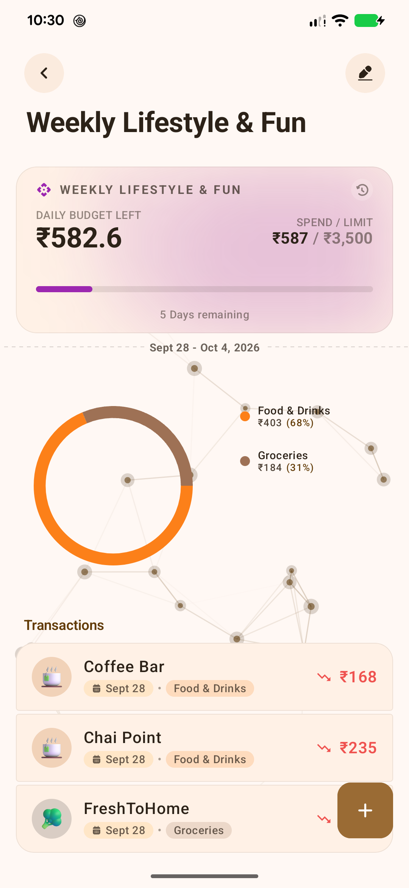<br /><b>Budget History</b><br /><sub>Historical performance tracking across previous cycles</sub></td>
    <td align="center" width="25%">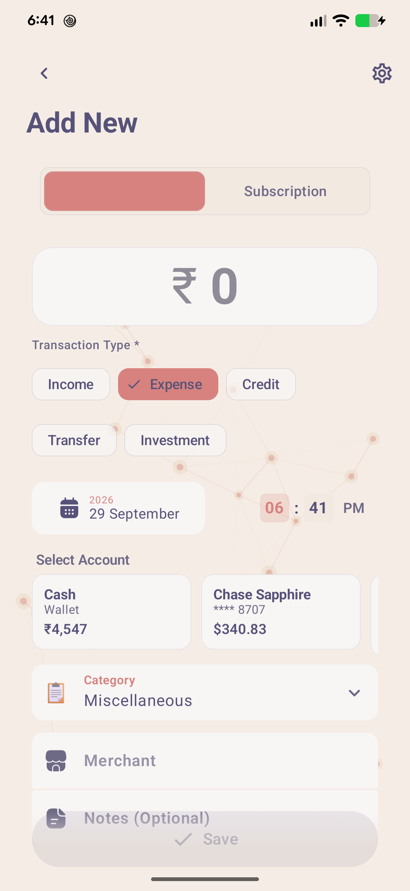<br /><b>Quick Add Flow</b><br /><sub>Rolling hero amount container & instant categorization</sub></td>
  </tr>
</table>

---

##  Key Features

### ⚡ 1. Intelligent On-Device SMS Parser
- **155+ Banks across 25+ Countries**: Auto-detects and decodes transaction alerts from leading banks across India, the US, UAE, Nepal, Thailand, Egypt, Nigeria, Saudi Arabia, Tanzania, Mozambique, Kenya, Colombia, and more.
- **Multilingual Support**: Parses SMS in English, Arabic, Thai, Swahili, Portuguese, Amharic, and Spanish.
- **Zero Inbox Alterations**: Read-only SMS inspection; your messages are never modified, sent, or uploaded.
- **Smart Metadata Extraction**: Automatically captures amount, currency, merchant/payee, timestamp, account last 4 digits, running balance, and transaction direction (Debit, Credit, Transfer, Investment).
- **Duplicate Suppression**: Intelligently de-duplicates multi-part bank notifications and UPI alerts.

### 📄 2. Smart UPI & Bank PDF Statement Parsing
- **UPI Statements**: Direct parsing of monthly transaction statements from **Google Pay (GPay)**, **PhonePe**, **Paytm**, and other digital payment apps.
- **Bank Statements**: Import standard PDF bank account and credit card statements directly into your financial ledger.
- **Branded Statement Generator**: Export crisp, publication-ready PDF statements with executive summaries, visual expense breakdowns, and categorized itemizations.
- **CSV Data Portability**: Export your entire ledger or filtered subsets as standard CSV files for tax filing, spreadsheet analysis, or personal backups.

### 👫 3. Couple / Partner P2P Sync (Flagship)
- **100% Serverless & Cloudless**: Share and sync financial activity with your partner without storing your financial life on a remote server.
- **Encrypted Local Mesh**: Direct device-to-device transport using **Google Play Services Nearby Connections** and **WebRTC** over local Wi-Fi or Bluetooth.
- **Effortless Pairing**: Pair instantly by scanning a QR code or entering a secure 6-character exchange code.
- **Unified Perspective**: Top app bar profile switcher allows you to seamlessly toggle between **Both**, **Me**, and **Partner** spending timelines.
- **Background Auto-Sync**: Automatically syncs newly registered transactions hourly when both devices are in proximity.
- **Granular Privacy Controls**: Choose which accounts or transaction tags are shared with your partner.

### 🤖 4. Google Gemini AI & Plain-English Quick Add (Beta)
- **Experimental Beta Feature**: Completely optional. Vittify remains 100% functional and offline without configuring any API key.
- **Bring Your Own Key (BYOK)**: Connect your private Google Gemini API key directly to your device—no third-party proxy servers or monthly subscriptions.
- **Model Flexibility**: Choose between `Gemini 2.5 Flash`, `Gemini 2.5 Pro`, or lightweight models based on your preference.
- **Natural Language Quick Add**: Simply type what you spent in natural English (e.g., *"Paid 450 for grocery at Blinkit via HDFC"* or *"Spent $34.50 on dinner with Sarah"*), and it automatically resolves amount, merchant, category, and payment account.
- **Offline Token Counter**: Monitor local request and token usage directly from the in-app AI settings.

### 📱 5. Home Screen Quick Add Widget
- **Glanceable Android Widget**: Quick Add widget pinned right to your Android home launcher.
- **Instant Logging**: Record cash spending, street purchases, or daily transit fares without launching the full application.

### 🎯 6. Granular Budgets & Spending Controls
- **Category-Level Limits**: Set flexible monthly spending caps for dining, groceries, shopping, travel, and more.
- **Adaptive Daily Allowance**: Calculates how much you can spend per day to stay within budget based on current velocity and days remaining.
- **Threshold Warnings**: Visual alerts and warning indicators when approaching 80% or 100% of your allocated limits.
- **Historical Budget Ledger**: Review past monthly performance to identify spending habits and seasonal trends.

### 🔁 7. Subscription & Recurring Payment Tracker
- **Commitment Forecasting**: Track all recurring payments (Netflix, Spotify, ChatGPT Plus, Amazon Prime, broadband, rent, utilities).
- **Monthly & Annual Projections**: Instant visibility into total annualized fixed costs.
- **Service Identity**: Recognizes recurring merchants and displays crisp brand icons and billing cycle countdowns.

### 💳 8. Multi-Currency & Advanced Account Management
- **Universal Multi-Currency Engine**: Native support for **INR (₹)**, **USD ($)**, **AED (د.إ)**, **EUR (€)**, **GBP (£)**, **NPR (₨)**, **THB (฿)**, **ETB (ብር)**, **TZS (TSh)**, **PKR (₨)**, and dozens more.
- **Live Approximate Conversions**: View foreign transactions with real-time approximate local currency equivalents.
- **Comprehensive Account Types**: Bank accounts, credit cards, investments, savings, digital wallets, and a dedicated **Cash Wallet**.
- **Running Ledger with Balance Trend Graphs**: Visualize balance evolution over time and reconcile manual adjustments easily.

### 📈 9. Interactive Analytics & Financial Heatmaps
- **Dynamic Trend Graphs**: Smooth animated bezier curves illustrating spend vs. income over custom horizons.
- **Category Donut Visualizations**: Interactive segment breakdowns with percentage contributions and quick drill-downs.
- **Daily Financial Heatmap**: GitHub-style activity heatmaps showing transaction intensity across every day of the month.
- **Flexible Time Horizons**: Switch between *Today*, *This Week*, *This Month*, *Last Month*, *Quarter*, *Year-to-Date*, or *Custom Date Range*.

### ⚙️ 10. Smart Automation Rules & Webhooks
- **Conditional Rule Engine**: Define triggers (e.g., *"If SMS merchant contains 'Uber' or 'Lyft', set category to Transport"*).
- **Automatic Account Mapping**: Automatically route transactions to specific accounts based on incoming sender patterns.
- **Outgoing HTTP Webhooks**: Fire real-time JSON webhooks to your private home automation servers, Notion databases, or custom dashboards whenever a transaction is recorded.

### 🎨 11. Material 3 Expressive Design & Theming
- **Dynamic Monet Theming**: Adapts dynamically to your Android wallpaper palette on Android 12+.
- **Curated Expressive Themes**: Hand-crafted themes including *Latte*, *Macchiato*, *Rosé Pine*, and high-contrast *AMOLED Pure Black*.
- **Animated Mesh Canvas**: Optional fluid animated background canvas providing tactile ambiance.
- **Navigation Modes**: Choose between edge-to-edge system navigation and a floating squircle navigation bar.
- **Custom Launcher Icons**: Personalize your home screen with themed app icons.

### 🔒 12. Privacy & Offline Sovereignty
- **Zero Cloud Architecture**: No sign-ups, no user accounts, no analytics tracking, no Firebase, and no advertisements.
- **Biometric Lock**: Protect your financial data with Android BiometricPrompt (Fingerprint / Face Unlock).
- **Encrypted Local Storage**: Sensitive settings and credentials stored using AndroidX EncryptedSharedPreferences and cryptographic keystores.
- **Data Sanitization**: Option to sanitize or mask sensitive account digits when sharing screenshots or exporting records.

---

## 🌍 Supported Banks & Regions (155+ Parsers)

Vittify includes a dedicated parsing engine (`:parser-core`) supporting over **155 financial institutions** across **25+ countries**:

<details open>
<summary><b>Click to expand the full list of supported banks</b></summary>

| Region | Currency | Supported Banks & Services |
| :--- | :---: | :--- |
| **🇮🇳 India** | `INR ₹` | HDFC Bank, State Bank of India (SBI), ICICI Bank, Axis Bank, Punjab National Bank (PNB), Bank of Baroda, Canara Bank, Union Bank, IDFC First Bank, Kotak Mahindra Bank, IndusInd Bank, Federal Bank, Indian Bank, IDBI Bank, Central Bank of India, South Indian Bank, Yes Bank, AU Small Finance Bank, Bandhan Bank, UCO Bank, Indian Overseas Bank, Jammu & Kashmir Bank (JK Bank), Karnataka Bank, Kerala Gramin Bank, Kerala State Co-operative Bank, Punjab & Sind Bank, Jana Small Finance Bank, Equitas Small Finance Bank, City Union Bank, Dhanlaxmi Bank, Standard Chartered India, DBS India, HSBC India, AMEX India, Department of Post (IPPB & DOP), Jupiter (CSB), Slice, OneCard, Pluxee (Sodexo), Cred, Cashfree, Navi Mutual Fund, HDFC Mutual Fund, Jio Payments Bank |
| **🇺🇸 United States** | `USD $` | Chase Bank, Citi Bank, Charles Schwab, Discover Card, Navy Federal Credit Union, Huntington Bank, Old Hickory Credit Union, AdelFi Credit Union, Altana Federal Credit Union, ALECU Credit Union |
| **🇦🇪 UAE** | `AED د.إ` | First Abu Dhabi Bank (FAB), Emirates NBD, Abu Dhabi Commercial Bank (ADCB), Emirates Islamic Bank, Mashreq Bank, Liv Bank |
| **🇳🇵 Nepal** | `NPR ₨` | Nabil Bank, NMB Bank, Everest Bank, Nepal SBI Bank, Laxmi Sunrise Bank, Siddhartha Bank, Citizens Bank International, Machchhapuchchhre Bank, Standard Chartered Nepal, Lumbini Bikash Bank, Nepal Bank Limited, Manjushree Finance, Prime Commercial Bank |
| **🇹🇭 Thailand** | `THB ฿` | Bangkok Bank, Kasikorn Bank (K-Bank), Siam Commercial Bank (SCB), Krungthai Bank, Krungsri (Bank of Ayudhya), TMBThanachart (TTB), Government Savings Bank (GSB), BAAC, UOB Thailand, CIMB Thai, KTC Credit Card |
| **🇪🇬 Egypt** | `EGP E£` | Commercial International Bank (CIB), National Bank of Egypt (NBE), Arab Bank Egypt |
| **🇳🇬 Nigeria** | `NGN ₦` | Access Bank, Guaranty Trust Bank (GTBank), Zenith Bank, Standard Chartered Nigeria, Keystone Bank, Jaiz Bank, Opay, Moniepoint MFB, VFD Microfinance Bank |
| **🇸🇦 Saudi Arabia** | `SAR ﷼` | Al Rajhi Bank, Saudi National Bank (SNB / Al Ahli), Banque Saudi Fransi (BSF), STC Bank, SABB (Saudi Awwal Bank), D360 Bank, Alinma Bank |
| **🇹🇿 Tanzania** | `TZS TSh` | NMB Bank Tanzania, CRDB Bank, Diamond Trust Bank (DTB), M-Pesa Tanzania, Tigo Pesa, Mixx by Yas, Selcom Pesa |
| **🇲🇿 Mozambique** | `MZN MT` | Standard Bank Mozambique, Millennium BIM, M-Pesa Mozambique, eMola |
| **🇰🇪 Kenya** | `KES Ksh` | Safaricom M-PESA |
| **🇪🇹 Ethiopia** | `ETB ብር` | Commercial Bank of Ethiopia (CBE), Telebirr, Dashen Bank, Awash Bank, Bank of Abyssinia, Zemen Bank, ZamZam Bank, Siket Bank, Apollo |
| **🇵🇰 Pakistan** | `PKR ₨` | Faysal Bank, Standard Chartered Pakistan |
| **🇮🇷 Iran** | `IRR ﷼` | Bank Melli Iran, Mellat Bank, Pasargad Bank, Parsian Bank, Middle East Bank (Bankino), blu Bank |
| **🇱🇰 Sri Lanka** | `LKR Rs` | Sampath Bank, Nations Trust Bank, National Savings Bank (NSB), National Development Bank (NDB) |
| **🇸🇻 El Salvador** | `USD $` | Banco Agrícola, Banco Cuscatlán, Banco Promerica |
| **🇨🇴 Colombia** | `COP $` | Bancolombia |
| **🇧🇩 Bangladesh** | `BDT ৳` | bKash Mobile Money |
| **🇷🇺 Russia** | `RUB ₽` | T-Bank (Tinkoff) |
| **🇧🇾 Belarus** | `BYN Br` | Priorbank |
| **🇩🇪 Germany** | `EUR €` | Sparkasse Rhein-Maas |
| **🇨🇿 Czech Republic**| `CZK Kč` | mBank CZ |
| **🇫🇷 France** | `EUR €` | BPCE |
| **🇹🇷 Turkey** | `TRY ₺` | Enpara Bank |
| **🇴🇲 Oman** | `OMR ر.ع.` | Bank Muscat |

*Need your bank supported? Open an issue with a sanitized sample SMS or contribute a parser in `:parser-core`!*
</details>

---

## 🛠️ Architecture & Engineering Standards

Vittify is engineered strictly in accordance with modern Android development best practices, Clean Architecture, and Unidirectional Data Flow (UDF).

```
UI (Jetpack Compose + Material 3 Expressive)
  │  ▲
  ▼  │ StateFlow / Immutable UI State
ViewModel
  │  ▲
  ▼  │ Kotlin Coroutines / Flows
Domain Use Cases & Models
  │  ▲
  ▼  │ Repository Interfaces
Data Layer
  ├── Room Database & Encrypted DAOs
  ├── Parser-Core (:parser-core) Bank Engine
  ├── DataStore Encrypted Preferences
  ├── P2P Transport (Nearby Connections & WebRTC)
  └── Gemini AI Ktor Service
```

### Module Breakdown

```text
vittify/
├── app/                                 # Android Application Module
│   └── src/main/java/com/reddy/vittify/
│       ├── core/                        # Core utilities, extensions, base classes
│       ├── data/                        # Repositories, Room DB, WebRTC, Gemini, Webhooks
│       ├── domain/                      # Use Cases, business rules, entities
│       ├── presentation/                # Material 3 Expressive UI layer
│       │   ├── ui/
│       │   │   ├── features/            # Feature composables (Home, Analytics, Budgets, Couple, etc.)
│       │   │   ├── components/          # Expressive design token components (Platters, Buttons, Slips)
│       │   │   └── theme/               # Tokens (VittifySpacing, VittifyShapes, CuratedThemes)
│       │   └── navigation/              # Type-safe Jetpack Navigation graph
│       ├── di/                          # Hilt dependency injection modules
│       └── widget/                      # Glanceable Home Screen Quick Add Widget
└── parser-core/                         # Pure Kotlin SMS & PDF Statement Engine
    └── src/main/kotlin/com/reddy/parser/core/
        ├── bank/                        # 155+ Individual Bank Parsers
        ├── factory/                     # BankParserFactory & Registry
        └── model/                       # ParsedTransaction, Currency & Rule definitions
```

---

## 💻 Tech Stack

<p align="center">
  <br>
  
</p>

| Component | Technology | Description |
| :--- | :--- | :--- |
| **Language** | **Kotlin 2.3.0** | Modern idiomatic Kotlin with coroutines and serialization |
| **UI Toolkit** | **Jetpack Compose** (BOM 2026.03.01) | Declarative UI with Kotlin Compose compiler |
| **Design System** | **Material 3 Expressive** (1.5.0-alpha12) | Squircle geometry, tonal surfaces, and spring dynamics |
| **Dependency Injection** | **Hilt 2.58** | Standard compile-time dependency injection |
| **Database** | **Room 2.8.4** | SQLite object mapping with Kotlin coroutines & Flow support |
| **Network & AI** | **Ktor Client 3.3.3** | High-performance asynchronous HTTP engine for Gemini AI & Webhooks |
| **P2P Transport** | **Play Services Nearby & WebRTC** | Direct device-to-device encrypted mesh networking |
| **PDF Processing** | **PdfBox Android (2.0.27.0)** | High-fidelity parsing and generation of financial PDF statements |
| **Security** | **AndroidX Biometric & Security Crypto** | Hardware-backed biometric authentication and AES keystore encryption |
| **Background Work** | **WorkManager 2.11.0** | Reliable scheduling for background partner sync and notification checks |
| **Visual Effects** | **Haze 1.7.1** | Hardware-accelerated frosted glass and depth blurs |
| **Charts** | **Compose Charts 0.2.0** | Smoothly animated canvas charts and donut breakdowns |

---

## 🚀 Getting Started

### Prerequisites

- **Android Studio Ladybug** (2024.2.1) or newer
- **JDK 17** or **JDK 21** configured
- **Android SDK Platform 36** (Target: Android 16)
- Physical device or emulator running **Android 8.0+ (API level 26+)**

### Building from Source

1. **Clone the repository**:
   ```bash
   git clone https://github.com/RReddy/Vittify.git
   cd Vittify
   ```

2. **Open in Android Studio** or build directly with Gradle:
   ```bash
   # Assemble the debug APK
   ./gradlew assembleDebug
   ```

3. **Install on connected device**:
   ```bash
   adb install -r app/build/outputs/apk/debug/app-debug.apk
   ```

4. **Run Unit & Parser Tests**:
   ```bash
   # Run parser-core verification and app unit tests
   ./gradlew test
   ```

---

## 🤝 Contributing

We welcome contributions from developers worldwide! Whether you'd like to add support for your local bank, enhance Material 3 Expressive components, or fix a bug:

1. **Fork the repository** on GitHub.
2. Read the [Parser Test Standards](docs/parser-test-standards.md) and [Design Principles](GEMINI.md).
3. If adding a new bank parser:
   - Create your parser in `parser-core/src/main/kotlin/com/reddy/parser/core/bank/`.
   - Register it in `BankParserFactory.kt`.
   - Write comprehensive unit tests with sanitized SMS samples in `parser-core/src/test/`.
4. Submit a well-documented **Pull Request**.

See [CONTRIBUTING.md](CONTRIBUTING.md) and our [Code of Conduct](CODE_OF_CONDUCT.md) for more details.

---

## 🔒 Security & Vulnerability Reporting

Security and privacy are fundamental to Vittify. If you identify a potential security or privacy flaw, please report it responsibly according to our [Security Policy](SECURITY.md) rather than opening a public issue.

---

## 💖 Credits & Acknowledgements

Vittify was forked from [**Cashiro**](https://github.com/ritesh-kanwar/Cashiro) by [ritesh-kanwar](https://github.com/ritesh-kanwar) — massive thanks for creating such an inspiring open-source foundation for local-first expense tracking on Android!

Vittify is also made possible thanks to these wonderful open-source libraries and design resources:

- [Cashiro](https://github.com/ritesh-kanwar/Cashiro) — The upstream open-source project Vittify was forked from.
- [Microsoft Fluent Emojis](https://github.com/microsoft/fluentui-emoji) — Beautiful 3D category artwork.
- [Haze](https://github.com/chrisbanes/haze) — Silky hardware-accelerated frosted glass blurs.
- [Stream WebRTC Android](https://github.com/getstream/stream-webrtc-android) — Robust peer-to-peer data channels for couple sync.
- [Compose Charts](https://github.com/ehsannarmani/ComposeCharts) — Interactive line, bar, and donut charts.
- [Reorderable](https://github.com/calintamas/reorderable) — Fluid drag-and-drop widget arrangement.
- [Iconax](https://iconax.io/) & [Material Symbols](https://fonts.google.com/icons) — Clean, optically consistent vector iconography.
- [PdfBox Android](https://github.com/TomRoush/PdfBox-Android) — Robust PDF parsing and report rendering.

---

## 📄 License

This project is licensed under the **GNU Affero General Public License v3.0 (AGPL-3.0)**. See the [LICENSE](LICENSE) file for the full text.

<p align="right"><a href="#top">▲ Back to top</a></p>
